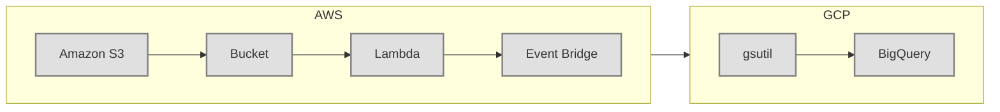

When using Mermaid diagrams in GitLab, there are a few things to keep in mind regarding layout and styling:

1. **Graph Direction Issue**: Despite using `graph LR` to set the direction from left to right, GitLab may not always render the layout as expected. This issue has been noted and discussed within the community, indicating some limitations or bugs in GitLab's rendering of Mermaid diagrams [oai_citation:1,Align flowchart items in LR layout · Issue #3148 · mermaid-js/mermaid · GitHub](https://github.com/mermaid-js/mermaid/issues/3148) [oai_citation:2,Standard mermaid syntax for flowchart links not rendered in GitLab (#273774) · Issues · GitLab.org / GitLab · GitLab](https://gitlab.com/gitlab-org/gitlab/-/issues/273774).

2. **Workaround for Consistent Layout**:
   - **Invisible Links**: To enforce the horizontal layout, you can use invisible links (`-->` without text) between nodes. This can help maintain the desired layout.
   - **Explicit Directions in Subgraphs**: Using `direction LR` within subgraphs can also help, although this may not always resolve the issue if the root cause lies in GitLab's rendering engine.

3. **Custom Styling**: GitLab has known issues with applying certain styles correctly. While you can define styles using `classDef`, some complex styles may not render as expected due to upstream issues with Mermaid's integration in GitLab [oai_citation:3,Mermaid diagrams apply custom stroke to text (#31078) · Issues · GitLab.org / GitLab · GitLab](https://gitlab.com/gitlab-org/gitlab/-/issues/31078) [oai_citation:4,Standard mermaid syntax for flowchart links not rendered in GitLab (#273774) · Issues · GitLab.org / GitLab · GitLab](https://gitlab.com/gitlab-org/gitlab/-/issues/273774).

### Example Code with Workarounds

Here’s an example that forces a horizontal layout using invisible links:

### Further Resources

For more detailed information and ongoing discussions about these issues, you can check out the following sources:
- [GitLab Mermaid Diagrams Issue](https://gitlab.com/gitlab-org/gitlab/-/issues/273774) discussing rendering issues and workarounds.
- [Mermaid Official Documentation](https://mermaid-js.github.io/mermaid/) for comprehensive syntax and examples.
- [GitLab Handbook on Mermaid Layouts](https://handbook.gitlab.com/) for advanced layout options and tips.

Using these resources, you can better understand and work around the limitations in GitLab's current implementation of Mermaid diagrams.