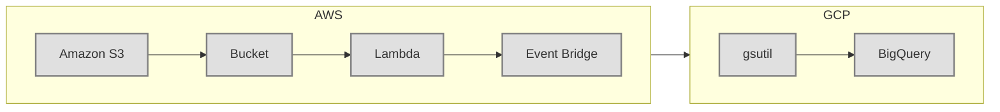

When using Mermaid diagrams in GitLab, there are a few things to keep in mind regarding layout and styling:

---
1. **Graph Direction Issue**: Despite using `graph LR` to set the direction from left to right, GitLab may not always render the layout as expected. This issue has been noted and discussed within the community, indicating some limitations or bugs in GitLab's rendering of Mermaid diagrams [oai_citation:1,Align flowchart items in LR layout · Issue #3148 · mermaid-js/mermaid · GitHub](https://github.com/mermaid-js/mermaid/issues/3148) [oai_citation:2,Standard mermaid syntax for flowchart links not rendered in GitLab (#273774) · Issues · GitLab.org / GitLab · GitLab](https://gitlab.com/gitlab-org/gitlab/-/issues/273774).

2. **Workaround for Consistent Layout**:
   - **Invisible Links**: To enforce the horizontal layout, you can use invisible links (`-->` without text) between nodes. This can help maintain the desired layout.
   - **Explicit Directions in Subgraphs**: Using `direction LR` within subgraphs can also help, although this may not always resolve the issue if the root cause lies in GitLab's rendering engine.

3. **Custom Styling**: GitLab has known issues with applying certain styles correctly. While you can define styles using `classDef`, some complex styles may not render as expected due to upstream issues with Mermaid's integration in GitLab [oai_citation:3,Mermaid diagrams apply custom stroke to text (#31078) · Issues · GitLab.org / GitLab · GitLab](https://gitlab.com/gitlab-org/gitlab/-/issues/31078) [oai_citation:4,Standard mermaid syntax for flowchart links not rendered in GitLab (#273774) · Issues · GitLab.org / GitLab · GitLab](https://gitlab.com/gitlab-org/gitlab/-/issues/273774).

### Example Code with Workarounds

Here’s an example that forces a horizontal layout using invisible links:


```mermaid
graph LR
    classDef nodeStyle fill:#e0e0e0,stroke:#808080,stroke-width:2px;

    subgraph AWS["AWS"]
        direction LR
        S3["Amazon S3"]:::nodeStyle
        S3 --> bucket["Bucket"]:::nodeStyle
        bucket --> Lambda["Lambda"]:::nodeStyle
        Lambda --> EventBridge["Event Bridge"]:::nodeStyle
    end

    subgraph GCP["GCP"]
        direction LR
        gsutil["gsutil"]:::nodeStyle
        gsutil --> BigQuery["BigQuery"]:::nodeStyle
    end

    AWS --> GCP
```

```
Attribute VB_Name = "MDM_RequestValidation"
Option Explicit

'==========================================================
' 申請Excel
'
' Button 1 : CheckBeforeId
'   - ID発行前チェック
'   - 必須チェック
'   - 05_参考記入方法のデータ型チェック
'   - 発行IDが空欄でもOK
'
' Button 2 : CheckAfterId
'   - ID発行後チェック
'   - IDを含めてフルチェック
'   - テーマ番号は半角数字5桁、10000～99999
'
' Button 3 : ExportRegistrationCSV
'   - CSV出力直前に再度フルチェック
'   - CSV出力（UTF-8 / BOMなし / CRLF）
'   - SYS_LOAD_ID / UPD_FLAG / SIDE_LOAD_FLAG を自動追加
'
' 申請フォーム:
'   D7:D65 = 物理名
'   E7:E65 = 入力値
'
' 参考記入方法:
'   D15:Dxx = 物理名
'   E15:Exx = データ型
'
' 対応データ型例:
'   VARCHAR(5), VARCHAR(140), VARCHAR(4000)
'   CHAR(n), STRING, TEXT
'   NUMBER(3,0), NUMBER(10,2), NUMERIC, DECIMAL
'   INTEGER, INT, BIGINT, SMALLINT
'   FLOAT, DOUBLE, REAL
'   DATE
'   TIMESTAMP, TIMESTAMP_NTZ/LTZ/TZ
'   BOOLEAN
'==========================================================


'==============================
' 設定
'==============================
Private Const FORM_SHEET As String = "04_申請フォーム"
Private Const GUIDE_SHEET As String = "05_参考記入方法"

Private Const FORM_FIRST_ROW As Long = 7
Private Const FORM_LAST_ROW As Long = 65

Private Const FORM_COL_PHYSICAL_NAME As String = "D"
Private Const FORM_COL_VALUE As String = "E"

Private Const GUIDE_FIRST_ROW As Long = 15
Private Const GUIDE_COL_PHYSICAL_NAME As String = "D"
Private Const GUIDE_COL_DATA_TYPE As String = "E"

' ★実際にBPO等が発行・記入するIDの物理名へ変更してください
' 例: THEME_ID / STUDY_ID / PRODUCT_FAMILY_ID 等
Private Const ISSUED_ID_FIELD As String = "THEME_ID"

' テーマ番号の項目固有チェック
' 申請フォーム D7 の項目をテーマ番号として扱う
' 参考記入方法では同項目が D15 に存在
Private Const THEME_FORM_ROW As Long = 7
Private Const THEME_GUIDE_ROW As Long = 15
Private Const THEME_NUMBER_MIN As Long = 10000
Private Const THEME_NUMBER_MAX As Long = 99999


'==========================================================
' Button 1
' 入力チェック
'
' ・発行IDが空欄でもOK
' ・それ以外の必須項目をチェック
' ・入力済み項目のデータ型/桁数をチェック
'==========================================================
Public Sub CheckBeforeId()

    Dim wsForm As Worksheet
    Dim wsGuide As Worksheet

    Set wsForm = ThisWorkbook.Worksheets(FORM_SHEET)
    Set wsGuide = ThisWorkbook.Worksheets(GUIDE_SHEET)

    If ValidateForm(wsForm, wsGuide, False) = False Then
        Exit Sub
    End If

    MsgBox _
        "ID発行前チェックが完了しました。" & vbCrLf & _
        "ID発行後、申請フォームへIDを入力し、次の「ID入力後チェック」を実行してください。", _
        vbInformation, _
        "ID発行前チェックOK"

End Sub


 '==========================================================
' Button 2
' ID入力後チェック
'
' ・発行IDを含めてフルチェック
' ・テーマ番号：半角数字5桁、10000～99999
' ・全入力済み項目のデータ型/桁数をチェック
'==========================================================
Public Sub CheckAfterId()

    Dim wsForm As Worksheet
    Dim wsGuide As Worksheet

    Set wsForm = ThisWorkbook.Worksheets(FORM_SHEET)
    Set wsGuide = ThisWorkbook.Worksheets(GUIDE_SHEET)

    If ValidateForm(wsForm, wsGuide, True) = False Then
        Exit Sub
    End If

    MsgBox _
        "ID入力後チェックが完了しました。" & vbCrLf & _
        "内容に問題ありません。CSV出力を実行してください。", _
        vbInformation, _
        "ID入力後チェックOK"

End Sub


'==========================================================
' Button 3
' CSV出力

'
' ・CSV出力直前に発行IDを含めて再度フルチェック
' ・OKの場合のみCSV出力
'==========================================================
Public Sub ExportRegistrationCSV()

    Dim wsForm As Worksheet
    Dim wsGuide As Worksheet
    Dim csvText As String
    Dim savePath As Variant

    Set wsForm = ThisWorkbook.Worksheets(FORM_SHEET)
    Set wsGuide = ThisWorkbook.Worksheets(GUIDE_SHEET)

    ' IDを含めて最終チェック
    If ValidateForm(wsForm, wsGuide, True) = False Then
        Exit Sub
    End If

    csvText = BuildCsvText(wsForm)

    savePath = Application.GetSaveAsFilename( _
                    InitialFileName:="registration.csv", _
                    FileFilter:="CSV Files (*.csv), *.csv")

    If VarType(savePath) = vbBoolean Then
        If savePath = False Then Exit Sub
    End If

    If LCase$(Right$(CStr(savePath), 4)) <> ".csv" Then
        savePath = CStr(savePath) & ".csv"
    End If

    SaveUtf8NoBom CStr(savePath), csvText

    MsgBox _
        "CSV出力が完了しました。" & vbCrLf & vbCrLf & _
        CStr(savePath), _
        vbInformation, _
        "CSV出力完了"

End Sub


'==========================================================
' 入力内容の総合チェック
'
' checkIssuedId = False
'   Button 1:
'   発行IDが空欄でもエラーにしない
'
' checkIssuedId = True
'   Button 2:
'   発行IDを含む全必須項目をチェック
'==========================================================
Private Function ValidateForm( _
    ByVal wsForm As Worksheet, _
    ByVal wsGuide As Worksheet, _
    ByVal checkIssuedId As Boolean _
) As Boolean

    Dim r As Long
    Dim physicalNameRaw As String
    Dim physicalName As String
    Dim inputValue As Variant
    Dim inputText As String
    Dim isRequired As Boolean

    Dim dataType As String
    Dim typeError As String

    ValidateForm = False

    For r = FORM_FIRST_ROW To FORM_LAST_ROW

        physicalNameRaw = Trim$(CStr(wsForm.Cells(r, FORM_COL_PHYSICAL_NAME).Value))

        If physicalNameRaw = "" Then
            GoTo ContinueLoop
        End If

        isRequired = (Right$(physicalNameRaw, 1) = "*")
        physicalName = RemoveRequiredMark(physicalNameRaw)

        inputValue = wsForm.Cells(r, FORM_COL_VALUE).Value
        inputText = Trim$(CStr(inputValue))

        '--------------------------------------------------
        ' 発行ID
        ' Button 1では空欄を許容
        ' Button 2では必須
        ' ※値が入っている場合はButton 1でも型チェックする
        '--------------------------------------------------
        If IsSameField(physicalName, ISSUED_ID_FIELD) Then

            If checkIssuedId = True And inputText = "" Then

                ShowValidationError _
                    wsForm, _
                    r, _
                    physicalName, _
                    "発行されたIDが入力されていません。"

                Exit Function

            End If

            If inputText = "" Then
                GoTo ContinueLoop
            End If

        Else

            '----------------------------------------------
            ' 通常の必須チェック
            '----------------------------------------------
            If isRequired = True And inputText = "" Then

                ShowValidationError _
                    wsForm, _
                    r, _
                    physicalName, _
                    "必須項目が入力されていません。"

                Exit Function

            End If

            ' 任意項目の空欄は型チェック不要
            If inputText = "" Then
                GoTo ContinueLoop
            End If

        End If

        '--------------------------------------------------
        ' 項目固有チェック：テーマ番号
        ' 申請フォーム D7 / E7 の項目
        ' （参考記入方法では D15 / E15）
        ' ・半角数字5桁
        ' ・10000～99999
        '--------------------------------------------------
        If r = THEME_FORM_ROW Then

            typeError = ""

            If ValidateThemeNumber(inputText, typeError) = False Then

                ShowValidationError _
                    wsForm, _
                    r, _
                    physicalName, _
                    "テーマ番号の制約に違反しています。" & vbCrLf & _
                    "条件：半角数字5桁、" & THEME_NUMBER_MIN & _
                    "～" & THEME_NUMBER_MAX & vbCrLf & _
                    "内容：" & typeError

                Exit Function

            End If

        End If

        '--------------------------------------------------
        ' 05_参考記入方法 からデータ型を取得
        ' D列=物理名 / E列=データ型
        '--------------------------------------------------
        dataType = GetDataTypeByPhysicalName(wsGuide, physicalName)

        If dataType = "" Then

            ShowValidationError _
                wsForm, _
                r, _
                physicalName, _
                "「" & GUIDE_SHEET & "」にデータ型の定義がありません。"

            Exit Function

        End If

        '--------------------------------------------------
        ' データ型・桁数チェック
        '--------------------------------------------------
        typeError = ""

        If ValidateValueByDataType(inputValue, inputText, dataType, typeError) = False Then

            ShowValidationError _
                wsForm, _
                r, _
                physicalName, _
                "データ型制約に違反しています。" & vbCrLf & _
                "定義：" & dataType & vbCrLf & _
                "内容：" & typeError

            Exit Function

        End If

ContinueLoop:

    Next r

    ValidateForm = True

End Function


'==========================================================
' 物理名からデータ型を取得
'
' GUIDE:
' D15:Dxx = 物理名
' E15:Exx = データ型
'
' 行順ではなく物理名で検索するため、
' 将来多少行順が変わっても対応可能
'==========================================================
Private Function GetDataTypeByPhysicalName( _
    ByVal wsGuide As Worksheet, _
    ByVal physicalName As String _
) As String

    Dim lastRow As Long
    Dim r As Long
    Dim guidePhysicalName As String

    GetDataTypeByPhysicalName = ""

    lastRow = wsGuide.Cells(wsGuide.Rows.Count, GUIDE_COL_PHYSICAL_NAME).End(xlUp).Row

    If lastRow < GUIDE_FIRST_ROW Then Exit Function

    For r = GUIDE_FIRST_ROW To lastRow

        guidePhysicalName = _
            RemoveRequiredMark( _
                Trim$(CStr(wsGuide.Cells(r, GUIDE_COL_PHYSICAL_NAME).Value)) _
            )

        If IsSameField(guidePhysicalName, physicalName) Then

            GetDataTypeByPhysicalName = _
                Trim$(CStr(wsGuide.Cells(r, GUIDE_COL_DATA_TYPE).Value))

            Exit Function

        End If

    Next r

End Function


'==========================================================
' テーマ番号チェック
'
' OK:
'   10000
'   99999
'
' NG:
'   65000
'   68000
'   6500
'   65001A
'   65.001
'==========================================================
Private Function ValidateThemeNumber( _
    ByVal inputText As String, _
    ByRef errorDetail As String _
) As Boolean

    Dim re As Object
    Dim themeNo As Long

    ValidateThemeNumber = False
    errorDetail = ""

    inputText = Trim$(inputText)

    ' 半角数字5桁のみ
    Set re = CreateObject("VBScript.RegExp")

    With re
        .Pattern = "^[0-9]{5}$"
        .IgnoreCase = False
        .Global = False
    End With

    If re.Test(inputText) = False Then

        errorDetail = _
            "テーマ番号は半角数字5桁で入力してください。" & _
            "（入力値：" & inputText & "）"

        Set re = Nothing
        Exit Function

    End If

    Set re = Nothing

    themeNo = CLng(inputText)

    ' 範囲チェック
    If themeNo < THEME_NUMBER_MIN Or themeNo > THEME_NUMBER_MAX Then

        errorDetail = _
            THEME_NUMBER_MIN & "～" & THEME_NUMBER_MAX & _
            " の範囲で入力してください。" & _
            "（入力値：" & inputText & "）"

        Exit Function

    End If

    ValidateThemeNumber = True

End Function


'==========================================================
' データ型に応じた入力値チェック
'==========================================================
Private Function ValidateValueByDataType( _
    ByVal rawValue As Variant, _
    ByVal inputText As String, _
    ByVal dataTypeRaw As String, _
    ByRef errorDetail As String _
) As Boolean

    Dim dataType As String
    Dim baseType As String
    Dim p As Long
    Dim s As Long
    Dim lengthLimit As Long

    ValidateValueByDataType = False
    errorDetail = ""

    dataType = NormalizeDataType(dataTypeRaw)
    baseType = GetBaseDataType(dataType)

    Select Case baseType

        '==================================================
        ' 文字列系
        '==================================================
        Case "VARCHAR", "CHAR", "CHARACTER", _
             "CHARACTERVARYING", "STRING", "TEXT"

            lengthLimit = GetSingleTypeParameter(dataType)

            If lengthLimit > 0 Then

                If Len(inputText) > lengthLimit Then

                    errorDetail = _
                        "文字数が上限 " & lengthLimit & _
                        " 文字を超えています。" & _
                        "（現在：" & Len(inputText) & "文字）"

                    Exit Function

                End If

            End If

        '==================================================
        ' NUMBER / NUMERIC / DECIMAL
        '==================================================
        Case "NUMBER", "NUMERIC", "DECIMAL"

            If IsValidNumberText(inputText) = False Then

                errorDetail = "数値として認識できません。"
                Exit Function

            End If

            GetPrecisionAndScale dataType, p, s

            ' NUMBER のように精度指定なしの場合は数値判定のみ
            If p > 0 Then

                If ValidateNumberPrecisionScale(inputText, p, s, errorDetail) = False Then
                    Exit Function
                End If

            End If

        '==================================================
        ' 整数系
        '==================================================
        Case "INTEGER", "INT", "BIGINT", "SMALLINT", "TINYINT", "BYTEINT"

            If IsValidIntegerText(inputText) = False Then

                errorDetail = "整数を入力してください。"
                Exit Function

            End If

        '==================================================
        ' 浮動小数点系
        '==================================================
        Case "FLOAT", "FLOAT4", "FLOAT8", "DOUBLE", _
             "DOUBLEPRECISION", "REAL"

            If IsValidNumberText(inputText) = False Then

                errorDetail = "数値を入力してください。"
                Exit Function

            End If

        '==================================================
        ' DATE
        '==================================================
        Case "DATE"

            If IsDate(rawValue) = False And IsDate(inputText) = False Then

                errorDetail = "日付として認識できません。"
                Exit Function

            End If

        '==================================================
        ' TIMESTAMP
        '==================================================
        Case "DATETIME", "TIMESTAMP", _
             "TIMESTAMPNTZ", "TIMESTAMPLTZ", "TIMESTAMPTZ"

            If IsDate(rawValue) = False And IsDate(inputText) = False Then

                errorDetail = "日時として認識できません。"
                Exit Function

            End If

        '==================================================
        ' BOOLEAN
        '==================================================
        Case "BOOLEAN", "BOOL"

            Select Case UCase$(inputText)
                Case "TRUE", "FALSE", "1", "0", "Y", "N", "YES", "NO"
                    ' OK
                Case Else
                    errorDetail = _
                        "BOOLEANとして認識できません。" & _
                        "（TRUE/FALSE、1/0、Y/N等を入力してください）"
                    Exit Function
            End Select

        '==================================================
        ' 未対応データ型
        ' 誤ってOKにしないためエラー
        '==================================================
        Case Else

            errorDetail = _
                "未対応のデータ型です：" & dataTypeRaw

            Exit Function

    End Select

    ValidateValueByDataType = True

End Function


'==========================================================
' NUMBER(p,s) の精度・スケールチェック
'
' 例:
' NUMBER(3,0)
'   123  -> OK
'   1234 -> NG
'   1.2  -> NG
'
' NUMBER(5,2)
'   123.45  -> OK
'   1234.5  -> NG（整数部最大3桁）
'   12.345  -> NG（小数部最大2桁）
'==========================================================
Private Function ValidateNumberPrecisionScale( _
    ByVal inputText As String, _
    ByVal precision As Long, _
    ByVal scale As Long, _
    ByRef errorDetail As String _
) As Boolean

    Dim s As String
    Dim parts() As String

    Dim integerPart As String
    Dim decimalPart As String

    Dim integerDigits As Long
    Dim decimalDigits As Long
    Dim totalDigits As Long
    Dim maxIntegerDigits As Long

    ValidateNumberPrecisionScale = False

    s = Trim$(inputText)

    ' 符号除去
    If Left$(s, 1) = "+" Or Left$(s, 1) = "-" Then
        s = Mid$(s, 2)
    End If

    parts = Split(s, ".")

    If UBound(parts) > 1 Then
        errorDetail = "小数点が複数あります。"
        Exit Function
    End If

    integerPart = parts(0)

    If UBound(parts) = 1 Then
        decimalPart = parts(1)
    Else
        decimalPart = ""
    End If

    ' 先頭0は精度計算上の桁数から除外
    Do While Len(integerPart) > 1 And Left$(integerPart, 1) = "0"
        integerPart = Mid$(integerPart, 2)
    Loop

    If integerPart = "" Then integerPart = "0"

    integerDigits = Len(integerPart)
    decimalDigits = Len(decimalPart)

    ' 0.xxx の整数部0は精度の有効桁に含めない
    If integerPart = "0" Then
        integerDigits = 0
    End If

    totalDigits = integerDigits + decimalDigits
    maxIntegerDigits = precision - scale

    If decimalDigits > scale Then

        errorDetail = _
            "小数部は " & scale & " 桁以内で入力してください。" & _
            "（現在：" & decimalDigits & "桁）"

        Exit Function

    End If

    If integerDigits > maxIntegerDigits Then

        errorDetail = _
            "整数部は " & maxIntegerDigits & " 桁以内で入力してください。" & _
            "（現在：" & integerDigits & "桁）"

        Exit Function

    End If

    If totalDigits > precision Then

        errorDetail = _
            "全体の有効桁数は " & precision & _
            " 桁以内で入力してください。" & _
            "（現在：" & totalDigits & "桁）"

        Exit Function

    End If

    ValidateNumberPrecisionScale = True

End Function


'==========================================================
' 数値文字列判定
'
' 許可:
' 123
' -123
' +123
' 12.34
' -0.5
'
' カンマ区切りや指数表記は許可しない
'==========================================================
Private Function IsValidNumberText(ByVal inputText As String) As Boolean

    Dim re As Object

    Set re = CreateObject("VBScript.RegExp")

    With re
        .Pattern = "^[+-]?([0-9]+)(\.[0-9]+)?$"
        .IgnoreCase = True
        .Global = False
    End With

    IsValidNumberText = re.Test(Trim$(inputText))

    Set re = Nothing

End Function


'==========================================================
' 整数文字列判定
'==========================================================
Private Function IsValidIntegerText(ByVal inputText As String) As Boolean

    Dim re As Object

    Set re = CreateObject("VBScript.RegExp")

    With re
        .Pattern = "^[+-]?[0-9]+$"
        .IgnoreCase = True
        .Global = False
    End With

    IsValidIntegerText = re.Test(Trim$(inputText))

    Set re = Nothing

End Function


'==========================================================
' VARCHAR(140) -> VARCHAR
' NUMBER(3,0)  -> NUMBER
' TIMESTAMP_NTZ(9) -> TIMESTAMPNTZ
'==========================================================
Private Function GetBaseDataType(ByVal normalizedDataType As String) As String

    Dim p As Long
    Dim baseType As String

    p = InStr(normalizedDataType, "(")

    If p > 0 Then
        baseType = Left$(normalizedDataType, p - 1)
    Else
        baseType = normalizedDataType
    End If

    baseType = Replace(baseType, "_", "")
    baseType = Replace(baseType, " ", "")

    GetBaseDataType = baseType

End Function


'==========================================================
' VARCHAR(140) -> 140
' 指定なしなら0
'==========================================================
Private Function GetSingleTypeParameter( _
    ByVal normalizedDataType As String _
) As Long

    Dim p1 As Long
    Dim p2 As Long
    Dim paramText As String

    GetSingleTypeParameter = 0

    p1 = InStr(normalizedDataType, "(")
    p2 = InStr(normalizedDataType, ")")

    If p1 = 0 Or p2 <= p1 Then Exit Function

    paramText = Mid$(normalizedDataType, p1 + 1, p2 - p1 - 1)
    paramText = Trim$(paramText)

    If IsNumeric(paramText) Then
        GetSingleTypeParameter = CLng(paramText)
    End If

End Function


'==========================================================
' NUMBER(5,2) -> precision=5 / scale=2
' NUMBER(3)   -> precision=3 / scale=0
' NUMBER      -> precision=0 / scale=0
'==========================================================
Private Sub GetPrecisionAndScale( _
    ByVal normalizedDataType As String, _
    ByRef precision As Long, _
    ByRef scale As Long _
)

    Dim p1 As Long
    Dim p2 As Long
    Dim paramText As String
    Dim params() As String

    precision = 0
    scale = 0

    p1 = InStr(normalizedDataType, "(")
    p2 = InStr(normalizedDataType, ")")

    If p1 = 0 Or p2 <= p1 Then Exit Sub

    paramText = Mid$(normalizedDataType, p1 + 1, p2 - p1 - 1)
    params = Split(paramText, ",")

    If UBound(params) >= 0 Then

        If IsNumeric(Trim$(params(0))) Then
            precision = CLng(Trim$(params(0)))
        End If

    End If

    If UBound(params) >= 1 Then

        If IsNumeric(Trim$(params(1))) Then
            scale = CLng(Trim$(params(1)))
        End If

    End If

End Sub


'==========================================================
' データ型表記を正規化
'
' 例:
' varchar ( 140 ) -> VARCHAR(140)
' number ( 3 , 0 ) -> NUMBER(3,0)
'==========================================================
Private Function NormalizeDataType(ByVal dataType As String) As String

    Dim s As String

    s = UCase$(Trim$(dataType))

    s = Replace(s, "（", "(")
    s = Replace(s, "）", ")")
    s = Replace(s, "，", ",")

    s = Replace(s, vbCr, "")
    s = Replace(s, vbLf, "")

    s = Replace(s, " ", "")

    NormalizeDataType = s

End Function


'==========================================================
' CSV文字列生成
'==========================================================
Private Function BuildCsvText(ByVal wsForm As Worksheet) As String

    Dim r As Long

    Dim headerLine As String
    Dim dataLine As String

    Dim physicalNameRaw As String
    Dim physicalName As String
    Dim inputValue As String

    For r = FORM_FIRST_ROW To FORM_LAST_ROW

        physicalNameRaw = _
            Trim$(CStr(wsForm.Cells(r, FORM_COL_PHYSICAL_NAME).Value))

        If physicalNameRaw <> "" Then

            physicalName = RemoveRequiredMark(physicalNameRaw)
            inputValue = CStr(wsForm.Cells(r, FORM_COL_VALUE).Value)

            If headerLine <> "" Then
                headerLine = headerLine & ","
                dataLine = dataLine & ","
            End If

            headerLine = headerLine & CsvEscape(physicalName)
            dataLine = dataLine & CsvEscape(inputValue)

        End If

    Next r

    ' システム項目
    ' SYS_LOAD_ID    : システム採番用（現時点では空欄）
    ' UPD_FLAG       : 登録時は I
    ' SIDE_LOAD_FLAG : 横入れ判定フラグ（現時点では空欄）
    headerLine = _
        headerLine & "," & _
        CsvEscape("SYS_LOAD_ID") & "," & _
        CsvEscape("UPD_FLAG") & "," & _
        CsvEscape("SIDE_LOAD_FLAG")

    dataLine = _
        dataLine & "," & _
        CsvEscape("") & "," & _
        CsvEscape("I") & "," & _
        CsvEscape("")

    ' CRLF
    BuildCsvText = _
        headerLine & vbCrLf & _
        dataLine & vbCrLf

End Function


'==========================================================
' UTF-8 / BOMなし で保存
'==========================================================
Private Sub SaveUtf8NoBom( _
    ByVal filePath As String, _
    ByVal textData As String _
)

    Dim textStream As Object
    Dim binaryStream As Object

    Set textStream = CreateObject("ADODB.Stream")

    With textStream

        .Type = 2
        .Charset = "UTF-8"
        .Open

        .WriteText textData

        ' UTF-8 BOM = 3 byte を除去
        .Position = 3
        .Type = 1

    End With

    Set binaryStream = CreateObject("ADODB.Stream")

    With binaryStream

        .Type = 1
        .Open

        textStream.CopyTo binaryStream

        .SaveToFile filePath, 2

        .Close

    End With

    textStream.Close

    Set binaryStream = Nothing
    Set textStream = Nothing

End Sub


'==========================================================
' CSVエスケープ
'==========================================================
Private Function CsvEscape(ByVal value As String) As String

    value = Replace(value, """", """""")

    If InStr(value, ",") > 0 _
       Or InStr(value, """") > 0 _
       Or InStr(value, vbCr) > 0 _
       Or InStr(value, vbLf) > 0 Then

        value = """" & value & """"

    End If

    CsvEscape = value

End Function


'==========================================================
' 必須マーク * を除去
'==========================================================
Private Function RemoveRequiredMark( _
    ByVal physicalName As String _
) As String

    physicalName = Trim$(physicalName)

    If Right$(physicalName, 1) = "*" Then
        physicalName = Left$(physicalName, Len(physicalName) - 1)
    End If

    RemoveRequiredMark = Trim$(physicalName)

End Function


'==========================================================
' 物理名比較
'==========================================================
Private Function IsSameField( _
    ByVal field1 As String, _
    ByVal field2 As String _
) As Boolean

    IsSameField = _
        (StrComp(Trim$(field1), Trim$(field2), vbTextCompare) = 0)

End Function


'==========================================================
' エラー表示
'==========================================================
Private Sub ShowValidationError( _
    ByVal ws As Worksheet, _
    ByVal rowNo As Long, _
    ByVal physicalName As String, _
    ByVal message As String _
)

    ws.Activate
    ws.Cells(rowNo, FORM_COL_VALUE).Select

    MsgBox _
        message & vbCrLf & vbCrLf & _
        "項目：" & physicalName & vbCrLf & _
        "セル：" & FORM_COL_VALUE & rowNo, _
        vbExclamation, _
        "入力チェックNG"

End Sub

```


### Further Resources

For more detailed information and ongoing discussions about these issues, you can check out the following sources:
- [GitLab Mermaid Diagrams Issue](https://gitlab.com/gitlab-org/gitlab/-/issues/273774) discussing rendering issues and workarounds.
- [Mermaid Official Documentation](https://mermaid-js.github.io/mermaid/) for comprehensive syntax and examples.
- [GitLab Handbook on Mermaid Layouts](https://handbook.gitlab.com/) for advanced layout options and tips.

Using these resources, you can better understand and work around the limitations in GitLab's current implementation of Mermaid diagrams.

graph LR
    classDef nodeStyle fill:#e0e0e0,stroke:#808080,stroke-width:2px;

    subgraph AWS["AWS"]
        direction LR
        S3["Amazon S3"]:::nodeStyle
        bucket["Bucket"]:::nodeStyle
        Lambda["Lambda"]:::nodeStyle
        EventBridge["Event Bridge"]:::nodeStyle
        S3 --o bucket
        Lambda --o bucket
        EventBridge --o Lambda
    end

    subgraph GCP["GCP"]
        direction LR
        gsutil["gsutil"]:::nodeStyle
        BigQuery["BigQuery"]:::nodeStyle
        gsutil --o BigQuery
    end

    AWS --> GCP

    %% Customizing arrow color to white to mimic transparency
    linkStyle 0 stroke:#ffffff;
    linkStyle 1 stroke:#ffffff;
    linkStyle 2 stroke:#ffffff;
    linkStyle 3 stroke:#ffffff;
    linkStyle 4 stroke:#ffffff;

graph LR
    classDef nodeStyle fill:#e0e0e0,stroke:#808080,stroke-width:2px;

    subgraph AWS["AWS"]
        direction LR
        S3["Amazon S3"]:::nodeStyle
        bucket["Bucket"]:::nodeStyle
        Lambda["Lambda"]:::nodeStyle
        EventBridge["Event Bridge"]:::nodeStyle
        S3 --> bucket
        Lambda --> bucket
        EventBridge --> Lambda
    end

    subgraph GCP["GCP"]
        direction LR
        gsutil["gsutil"]:::nodeStyle
        BigQuery["BigQuery"]:::nodeStyle
        gsutil --> BigQuery
    end

    AWS --> GCP

    %% Customizing arrow color to white to mimic transparency
    linkStyle 0 stroke:#ffffff,stroke-width:0px;
    linkStyle 1 stroke:#ffffff,stroke-width:0px;
    linkStyle 2 stroke:#ffffff,stroke-width:0px;
    linkStyle 3 stroke:#ffffff,stroke-width:0px;
    linkStyle 4 stroke:#ffffff,stroke-width:0px;
    linkStyle 5 stroke:#ffffff,stroke-width:0px;

