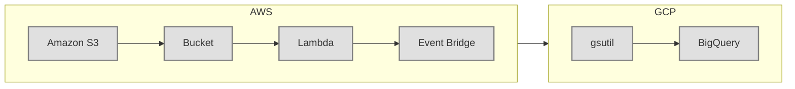

When using Mermaid diagrams in GitLab, there are a few things to keep in mind regarding layout and styling:

---
1. **Graph Direction Issue**: Despite using `graph LR` to set the direction from left to right, GitLab may not always render the layout as expected. This issue has been noted and discussed within the community, indicating some limitations or bugs in GitLab's rendering of Mermaid diagrams [oai_citation:1,Align flowchart items in LR layout · Issue #3148 · mermaid-js/mermaid · GitHub](https://github.com/mermaid-js/mermaid/issues/3148) [oai_citation:2,Standard mermaid syntax for flowchart links not rendered in GitLab (#273774) · Issues · GitLab.org / GitLab · GitLab](https://gitlab.com/gitlab-org/gitlab/-/issues/273774).

2. **Workaround for Consistent Layout**:
   - **Invisible Links**: To enforce the horizontal layout, you can use invisible links (`-->` without text) between nodes. This can help maintain the desired layout.
   - **Explicit Directions in Subgraphs**: Using `direction LR` within subgraphs can also help, although this may not always resolve the issue if the root cause lies in GitLab's rendering engine.

3. **Custom Styling**: GitLab has known issues with applying certain styles correctly. While you can define styles using `classDef`, some complex styles may not render as expected due to upstream issues with Mermaid's integration in GitLab [oai_citation:3,Mermaid diagrams apply custom stroke to text (#31078) · Issues · GitLab.org / GitLab · GitLab](https://gitlab.com/gitlab-org/gitlab/-/issues/31078) [oai_citation:4,Standard mermaid syntax for flowchart links not rendered in GitLab (#273774) · Issues · GitLab.org / GitLab · GitLab](https://gitlab.com/gitlab-org/gitlab/-/issues/273774).

### Example Code with Workarounds

Here’s an example that forces a horizontal layout using invisible links:


```mermaid
graph LR
    classDef nodeStyle fill:#e0e0e0,stroke:#808080,stroke-width:2px;

    subgraph AWS["AWS"]
        direction LR
        S3["Amazon S3"]:::nodeStyle
        S3 --> bucket["Bucket"]:::nodeStyle
        bucket --> Lambda["Lambda"]:::nodeStyle
        Lambda --> EventBridge["Event Bridge"]:::nodeStyle
    end

    subgraph GCP["GCP"]
        direction LR
        gsutil["gsutil"]:::nodeStyle
        gsutil --> BigQuery["BigQuery"]:::nodeStyle
    end

    AWS --> GCP
```

```
Option Explicit

'==========================================================
' 申請Excel
'
' ① CheckBeforeId
'    ID発行前チェック
'
' ② CheckAfterId
'    ID入力後チェック
'
' ③ ExportRegistrationCSV
'    最終チェック後にCSV出力
'
' 前提
' 04_申請フォーム
'   D7:D65 = 物理名
'   E7:E65 = 入力値
'
' 05_参考記入方法
'   D15:Dxx = 物理名
'   E15:Exx = データ型
'
' 対応データ型
'   VARCHAR(n)
'   NUMBER(p,s)
'
' テーマ番号
'   04_申請フォーム E7
'   半角数字5桁 / 10000～99999
'
' CSV末尾へ自動追加
'   SYS_LOAD_ID    = 空欄
'   UPD_FLAG       = I
'   SIDE_LOAD_FLAG = 空欄
'
' CSV形式
'   UTF-8 / BOMなし / CRLF
'==========================================================

Private Const FORM_SHEET As String = "04_申請フォーム"
Private Const GUIDE_SHEET As String = "05_参考記入方法"

Private Const FORM_FIRST_ROW As Long = 7
Private Const FORM_LAST_ROW As Long = 65
Private Const GUIDE_FIRST_ROW As Long = 15

Private Const COL_PHYSICAL As String = "D"
Private Const COL_VALUE As String = "E"

Private Const THEME_ROW As Long = 7
Private Const THEME_MIN As Long = 10000
Private Const THEME_MAX As Long = 99999


'==========================================================
' ① ID発行前チェック
' E7（テーマ番号）は空欄でもOK
'==========================================================
Public Sub CheckBeforeId()

    If ValidateAll(False) = False Then Exit Sub

    MsgBox _
        "ID発行前チェックが完了しました。" & vbCrLf & _
        "ID発行後、E7へテーマ番号を入力して②を実行してください。", _
        vbInformation, _
        "チェックOK"

End Sub


'==========================================================
' ② ID入力後チェック
' E7（テーマ番号）は必須
'==========================================================
Public Sub CheckAfterId()

    If ValidateAll(True) = False Then Exit Sub

    MsgBox _
        "ID入力後チェックが完了しました。" & vbCrLf & _
        "内容に問題ありません。③CSV出力を実行してください。", _
        vbInformation, _
        "チェックOK"

End Sub


'==========================================================
' ③ CSV出力
' 出力直前にもう一度フルチェック
'==========================================================
Public Sub ExportRegistrationCSV()

    Dim csvText As String
    Dim savePath As Variant

    If ValidateAll(True) = False Then Exit Sub

    csvText = BuildCsvText()

    savePath = Application.GetSaveAsFilename( _
                    InitialFileName:="registration.csv", _
                    FileFilter:="CSV Files (*.csv), *.csv")

    If VarType(savePath) = vbBoolean Then
        If savePath = False Then Exit Sub
    End If

    If LCase$(Right$(CStr(savePath), 4)) <> ".csv" Then
        savePath = CStr(savePath) & ".csv"
    End If

    SaveUtf8NoBom CStr(savePath), csvText

    MsgBox _
        "CSV出力が完了しました。" & vbCrLf & _
        CStr(savePath), _
        vbInformation, _
        "CSV出力完了"

End Sub


'==========================================================
' 全項目チェック
'
' requireThemeId = False
'   → ① ID発行前。E7空欄OK
'
' requireThemeId = True
'   → ② / ③。E7必須
'==========================================================
Private Function ValidateAll(ByVal requireThemeId As Boolean) As Boolean

    Dim wsForm As Worksheet
    Dim wsGuide As Worksheet

    Dim r As Long
    Dim physicalRaw As String
    Dim physicalName As String
    Dim valueText As String
    Dim dataType As String
    Dim isRequired As Boolean
    Dim errMsg As String

    Set wsForm = ThisWorkbook.Worksheets(FORM_SHEET)
    Set wsGuide = ThisWorkbook.Worksheets(GUIDE_SHEET)

    ValidateAll = False

    For r = FORM_FIRST_ROW To FORM_LAST_ROW

        physicalRaw = Trim$(CStr(wsForm.Cells(r, COL_PHYSICAL).Value))

        If physicalRaw = "" Then GoTo NextRow

        physicalName = RemoveRequiredMark(physicalRaw)
        isRequired = (Right$(physicalRaw, 1) = "*")
        valueText = Trim$(CStr(wsForm.Cells(r, COL_VALUE).Value))

        '--------------------------------------------------
        ' テーマ番号（E7）
        '--------------------------------------------------
        If r = THEME_ROW Then

            If valueText = "" Then

                If requireThemeId = True Then
                    ShowError wsForm, r, physicalName, _
                        "テーマ番号が入力されていません。"
                    Exit Function
                Else
                    GoTo NextRow
                End If

            End If

            If CheckThemeNumber(valueText, errMsg) = False Then
                ShowError wsForm, r, physicalName, errMsg
                Exit Function
            End If

        Else

            '--------------------------------------------------
            ' 通常必須チェック
            '--------------------------------------------------
            If isRequired = True And valueText = "" Then
                ShowError wsForm, r, physicalName, _
                    "必須項目が入力されていません。"
                Exit Function
            End If

            ' 任意項目の空欄は型チェックしない
            If valueText = "" Then GoTo NextRow

        End If

        '--------------------------------------------------
        ' 参考記入方法から型を取得
        '--------------------------------------------------
        dataType = FindDataType(wsGuide, physicalName)

        If dataType = "" Then
            ShowError wsForm, r, physicalName, _
                "「" & GUIDE_SHEET & "」にデータ型定義がありません。"
            Exit Function
        End If

        '--------------------------------------------------
        ' VARCHAR / NUMBER チェック
        '--------------------------------------------------
        errMsg = ""

        If CheckDataType(valueText, dataType, errMsg) = False Then
            ShowError wsForm, r, physicalName, _
                "データ型制約に違反しています。" & vbCrLf & _
                "定義：" & dataType & vbCrLf & _
                "内容：" & errMsg
            Exit Function
        End If

NextRow:

    Next r

    ValidateAll = True

End Function


'==========================================================
' テーマ番号
' ・半角数字5桁
' ・10000～99999
'==========================================================
Private Function CheckThemeNumber( _
    ByVal valueText As String, _
    ByRef errMsg As String _
) As Boolean

    Dim i As Long
    Dim n As Long
    Dim ch As String

    CheckThemeNumber = False
    errMsg = ""

    valueText = Trim$(valueText)

    If Len(valueText) <> 5 Then
        errMsg = "テーマ番号は半角数字5桁で入力してください。"
        Exit Function
    End If

    For i = 1 To 5

        ch = Mid$(valueText, i, 1)

        If ch < "0" Or ch > "9" Then
            errMsg = "テーマ番号は半角数字のみで入力してください。"
            Exit Function
        End If

    Next i

    n = CLng(valueText)

    If n < THEME_MIN Or n > THEME_MAX Then
        errMsg = _
            CStr(THEME_MIN) & "～" & CStr(THEME_MAX) & _
            " の範囲で入力してください。"
        Exit Function
    End If

    CheckThemeNumber = True

End Function


'==========================================================
' 物理名からデータ型取得
' D15以降を検索し、同じ行のE列を返す
'==========================================================
Private Function FindDataType( _
    ByVal wsGuide As Worksheet, _
    ByVal physicalName As String _
) As String

    Dim lastRow As Long
    Dim r As Long
    Dim guideName As String

    FindDataType = ""

    lastRow = wsGuide.Cells(wsGuide.Rows.Count, COL_PHYSICAL).End(xlUp).Row

    For r = GUIDE_FIRST_ROW To lastRow

        guideName = RemoveRequiredMark( _
                        Trim$(CStr(wsGuide.Cells(r, COL_PHYSICAL).Value)))

        If StrComp(guideName, physicalName, vbTextCompare) = 0 Then
            FindDataType = Trim$(CStr(wsGuide.Cells(r, COL_VALUE).Value))
            Exit Function
        End If

    Next r

End Function


'==========================================================
' データ型チェック
'
' 対応：
'   VARCHAR(n)
'   NUMBER(p,s)
'
' それ以外の型はエラー
'==========================================================
Private Function CheckDataType( _
    ByVal valueText As String, _
    ByVal dataTypeRaw As String, _
    ByRef errMsg As String _
) As Boolean

    Dim dt As String
    Dim p1 As Long
    Dim p2 As Long
    Dim commaPos As Long

    Dim paramText As String
    Dim precisionText As String
    Dim scaleText As String

    Dim maxLen As Long
    Dim numPrecision As Long
    Dim numScale As Long
    Dim maxIntegerDigits As Long

    Dim s As String
    Dim i As Long
    Dim ch As String
    Dim dotCount As Long
    Dim dotPos As Long

    Dim integerPart As String
    Dim decimalPart As String
    Dim integerDigits As Long
    Dim decimalDigits As Long

    CheckDataType = False
    errMsg = ""

    ' データ型表記を統一
    dt = UCase$(Trim$(dataTypeRaw))
    dt = Replace(dt, "（", "(")
    dt = Replace(dt, "）", ")")
    dt = Replace(dt, "，", ",")
    dt = Replace(dt, " ", "")
    dt = Replace(dt, vbCr, "")
    dt = Replace(dt, vbLf, "")

    '======================================================
    ' VARCHAR(n)
    '======================================================
    If Left$(dt, 7) = "VARCHAR" Then

        p1 = InStr(dt, "(")
        p2 = InStr(dt, ")")

        If p1 = 0 Or p2 <= p1 Then
            errMsg = "VARCHARの桁数定義を取得できません：" & dataTypeRaw
            Exit Function
        End If

        paramText = Mid$(dt, p1 + 1, p2 - p1 - 1)

        If IsNumeric(paramText) = False Then
            errMsg = "VARCHARの桁数定義が不正です：" & dataTypeRaw
            Exit Function
        End If

        maxLen = CLng(paramText)

        If Len(valueText) > maxLen Then
            errMsg = CStr(maxLen) & "文字以内で入力してください。" & _
                     "（現在：" & CStr(Len(valueText)) & "文字）"
            Exit Function
        End If

        CheckDataType = True
        Exit Function

    End If

    '======================================================
    ' NUMBER(p,s)
    '======================================================
    If Left$(dt, 6) = "NUMBER" Then

        p1 = InStr(dt, "(")
        p2 = InStr(dt, ")")

        If p1 = 0 Or p2 <= p1 Then
            errMsg = "NUMBERの桁数定義を取得できません：" & dataTypeRaw
            Exit Function
        End If

        paramText = Mid$(dt, p1 + 1, p2 - p1 - 1)
        commaPos = InStr(paramText, ",")

        ' NUMBER(3) の場合は scale=0
        If commaPos = 0 Then

            precisionText = paramText
            scaleText = "0"

        Else

            precisionText = Left$(paramText, commaPos - 1)
            scaleText = Mid$(paramText, commaPos + 1)

        End If

        If IsNumeric(precisionText) = False Then
            errMsg = "NUMBERのprecision定義が不正です：" & dataTypeRaw
            Exit Function
        End If

        If IsNumeric(scaleText) = False Then
            errMsg = "NUMBERのscale定義が不正です：" & dataTypeRaw
            Exit Function
        End If

        numPrecision = CLng(precisionText)
        numScale = CLng(scaleText)

        If numPrecision <= 0 Then
            errMsg = "NUMBERのprecisionは1以上で指定してください。"
            Exit Function
        End If

        If numScale < 0 Or numScale > numPrecision Then
            errMsg = "NUMBERのscale定義が不正です：" & dataTypeRaw
            Exit Function
        End If

        '--------------------------------------------------
        ' 入力値の形式チェック
        '--------------------------------------------------
        s = Trim$(valueText)

        If s = "" Then
            errMsg = "数値を入力してください。"
            Exit Function
        End If

        ' 先頭の + / - は許可
        If Left$(s, 1) = "+" Or Left$(s, 1) = "-" Then
            s = Mid$(s, 2)
        End If

        If s = "" Then
            errMsg = "数値を入力してください。"
            Exit Function
        End If

        dotCount = 0

        For i = 1 To Len(s)

            ch = Mid$(s, i, 1)

            If ch < "0" Or ch > "9" Then

                If ch = "." Then
                    dotCount = dotCount + 1

                    If dotCount > 1 Then
                        errMsg = "数値形式が不正です。"
                        Exit Function
                    End If

                Else
                    errMsg = "数値を入力してください。"
                    Exit Function
                End If

            End If

        Next i

        If Left$(s, 1) = "." Or Right$(s, 1) = "." Then
            errMsg = "数値形式が不正です。"
            Exit Function
        End If

        '--------------------------------------------------
        ' 整数部 / 小数部の桁数チェック
        '--------------------------------------------------
        dotPos = InStr(s, ".")

        If dotPos > 0 Then
            integerPart = Left$(s, dotPos - 1)
            decimalPart = Mid$(s, dotPos + 1)
        Else
            integerPart = s
            decimalPart = ""
        End If

        ' 先頭0は桁数計算から除外
        Do While Len(integerPart) > 1 And Left$(integerPart, 1) = "0"
            integerPart = Mid$(integerPart, 2)
        Loop

        If integerPart = "0" Then
            integerDigits = 0
        Else
            integerDigits = Len(integerPart)
        End If

        decimalDigits = Len(decimalPart)
        maxIntegerDigits = numPrecision - numScale

        If integerDigits > maxIntegerDigits Then
            errMsg = "整数部は" & CStr(maxIntegerDigits) & _
                     "桁以内で入力してください。"
            Exit Function
        End If

        If decimalDigits > numScale Then
            errMsg = "小数部は" & CStr(numScale) & _
                     "桁以内で入力してください。"
            Exit Function
        End If

        CheckDataType = True
        Exit Function

    End If

    '======================================================
    ' 未対応型
    '======================================================
    errMsg = "現在のマクロはVARCHARとNUMBERのみ対応しています。" & _
             "（定義：" & dataTypeRaw & "）"

End Function


'==========================================================
' CSV生成
'==========================================================
Private Function BuildCsvText() As String

    Dim wsForm As Worksheet
    Dim r As Long

    Dim headerLine As String
    Dim dataLine As String
    Dim physicalRaw As String
    Dim physicalName As String
    Dim valueText As String

    Set wsForm = ThisWorkbook.Worksheets(FORM_SHEET)

    For r = FORM_FIRST_ROW To FORM_LAST_ROW

        physicalRaw = Trim$(CStr(wsForm.Cells(r, COL_PHYSICAL).Value))

        If physicalRaw <> "" Then

            physicalName = RemoveRequiredMark(physicalRaw)
            valueText = CStr(wsForm.Cells(r, COL_VALUE).Value)

            If headerLine <> "" Then
                headerLine = headerLine & ","
                dataLine = dataLine & ","
            End If

            headerLine = headerLine & CsvEscape(physicalName)
            dataLine = dataLine & CsvEscape(valueText)

        End If

    Next r

    headerLine = _
        headerLine & "," & _
        CsvEscape("SYS_LOAD_ID") & "," & _
        CsvEscape("UPD_FLAG") & "," & _
        CsvEscape("SIDE_LOAD_FLAG")

    dataLine = _
        dataLine & "," & _
        CsvEscape("") & "," & _
        CsvEscape("I") & "," & _
        CsvEscape("")

    BuildCsvText = _
        headerLine & vbCrLf & _
        dataLine & vbCrLf

End Function


'==========================================================
' CSVエスケープ
'==========================================================
Private Function CsvEscape(ByVal valueText As String) As String

    valueText = Replace(valueText, """", """""")

    If InStr(valueText, ",") > 0 _
       Or InStr(valueText, """") > 0 _
       Or InStr(valueText, vbCr) > 0 _
       Or InStr(valueText, vbLf) > 0 Then

        valueText = """" & valueText & """"

    End If

    CsvEscape = valueText

End Function


'==========================================================
' UTF-8 / BOMなし保存
'==========================================================
Private Sub SaveUtf8NoBom( _
    ByVal filePath As String, _
    ByVal textData As String _
)

    Dim textStream As Object
    Dim binaryStream As Object

    Set textStream = CreateObject("ADODB.Stream")

    With textStream
        .Type = 2
        .Charset = "UTF-8"
        .Open
        .WriteText textData

        ' Binaryへ切替後、UTF-8 BOM 3バイトを読み飛ばす
        .Position = 0
        .Type = 1
        .Position = 3
    End With

    Set binaryStream = CreateObject("ADODB.Stream")

    With binaryStream
        .Type = 1
        .Open
        textStream.CopyTo binaryStream
        .SaveToFile filePath, 2
        .Close
    End With

    textStream.Close

    Set binaryStream = Nothing
    Set textStream = Nothing

End Sub


'==========================================================
' 必須マーク * 除去
'==========================================================
Private Function RemoveRequiredMark(ByVal physicalName As String) As String

    physicalName = Trim$(physicalName)

    If Len(physicalName) > 0 Then

        If Right$(physicalName, 1) = "*" Then
            physicalName = Left$(physicalName, Len(physicalName) - 1)
        End If

    End If

    RemoveRequiredMark = Trim$(physicalName)

End Function


'==========================================================
' エラー表示
'==========================================================
Private Sub ShowError( _
    ByVal ws As Worksheet, _
    ByVal rowNo As Long, _
    ByVal physicalName As String, _
    ByVal messageText As String _
)

    ws.Activate
    ws.Cells(rowNo, COL_VALUE).Select

    MsgBox _
        messageText & vbCrLf & vbCrLf & _
        "項目：" & physicalName & vbCrLf & _
        "セル：" & COL_VALUE & CStr(rowNo), _
        vbExclamation, _
        "入力チェックNG"

End Sub


```


### Further Resources

For more detailed information and ongoing discussions about these issues, you can check out the following sources:
- [GitLab Mermaid Diagrams Issue](https://gitlab.com/gitlab-org/gitlab/-/issues/273774) discussing rendering issues and workarounds.
- [Mermaid Official Documentation](https://mermaid-js.github.io/mermaid/) for comprehensive syntax and examples.
- [GitLab Handbook on Mermaid Layouts](https://handbook.gitlab.com/) for advanced layout options and tips.

Using these resources, you can better understand and work around the limitations in GitLab's current implementation of Mermaid diagrams.

graph LR
    classDef nodeStyle fill:#e0e0e0,stroke:#808080,stroke-width:2px;

    subgraph AWS["AWS"]
        direction LR
        S3["Amazon S3"]:::nodeStyle
        bucket["Bucket"]:::nodeStyle
        Lambda["Lambda"]:::nodeStyle
        EventBridge["Event Bridge"]:::nodeStyle
        S3 --o bucket
        Lambda --o bucket
        EventBridge --o Lambda
    end

    subgraph GCP["GCP"]
        direction LR
        gsutil["gsutil"]:::nodeStyle
        BigQuery["BigQuery"]:::nodeStyle
        gsutil --o BigQuery
    end

    AWS --> GCP

    %% Customizing arrow color to white to mimic transparency
    linkStyle 0 stroke:#ffffff;
    linkStyle 1 stroke:#ffffff;
    linkStyle 2 stroke:#ffffff;
    linkStyle 3 stroke:#ffffff;
    linkStyle 4 stroke:#ffffff;

graph LR
    classDef nodeStyle fill:#e0e0e0,stroke:#808080,stroke-width:2px;

    subgraph AWS["AWS"]
        direction LR
        S3["Amazon S3"]:::nodeStyle
        bucket["Bucket"]:::nodeStyle
        Lambda["Lambda"]:::nodeStyle
        EventBridge["Event Bridge"]:::nodeStyle
        S3 --> bucket
        Lambda --> bucket
        EventBridge --> Lambda
    end

    subgraph GCP["GCP"]
        direction LR
        gsutil["gsutil"]:::nodeStyle
        BigQuery["BigQuery"]:::nodeStyle
        gsutil --> BigQuery
    end

    AWS --> GCP

    %% Customizing arrow color to white to mimic transparency
    linkStyle 0 stroke:#ffffff,stroke-width:0px;
    linkStyle 1 stroke:#ffffff,stroke-width:0px;
    linkStyle 2 stroke:#ffffff,stroke-width:0px;
    linkStyle 3 stroke:#ffffff,stroke-width:0px;
    linkStyle 4 stroke:#ffffff,stroke-width:0px;
    linkStyle 5 stroke:#ffffff,stroke-width:0px;

