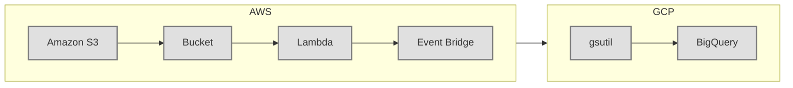

When using Mermaid diagrams in GitLab, there are a few things to keep in mind regarding layout and styling:
```
Option Explicit

Sub ExportRegistrationCSV()

    '========================================
    ' 設定
    '========================================
    Const SOURCE_SHEET As String = "04_申請フォーム"

    Const START_ROW As Long = 7
    Const END_ROW As Long = 65

    Const HEADER_COL As String = "D"
    Const VALUE_COL As String = "E"

    Const SYS_LOAD_ID_HEADER As String = "SYS_LOAD_ID"
    Const UPD_FLAG_HEADER As String = "UPD_FLAG"

    Const UPD_FLAG_VALUE As String = "I"

    '========================================
    ' 変数
    '========================================
    Dim wb As Workbook
    Dim wsSource As Worksheet

    Dim outputWb As Workbook
    Dim outputWs As Worksheet

    Dim savePath As Variant

    Dim i As Long
    Dim outputCol As Long

    Dim rawColumnName As String
    Dim columnName As String
    Dim inputValue As Variant

    Dim isRequired As Boolean
    Dim missingItems As String

    Dim sysLoadId As String

    '========================================
    ' 対象ブック・入力元シート
    '========================================
    Set wb = ThisWorkbook
    Set wsSource = wb.Worksheets(SOURCE_SHEET)

    '========================================
    ' 必須項目チェック
    '
    ' D列の物理名末尾に「*」がある場合、
    ' E列の入力値が空欄ならCSV出力しない
    '========================================
    missingItems = ""

    For i = START_ROW To END_ROW

        rawColumnName = Trim(CStr(wsSource.Cells(i, HEADER_COL).Value))

        If rawColumnName <> "" Then

            ' 末尾が * なら必須項目
            isRequired = (Right(rawColumnName, 1) = "*")

            If isRequired Then

                ' 必須項目なのに値が未入力
                If Trim(CStr(wsSource.Cells(i, VALUE_COL).Value)) = "" Then

                    ' エラー表示用に末尾の * を除く
                    columnName = Left(rawColumnName, Len(rawColumnName) - 1)

                    If missingItems <> "" Then
                        missingItems = missingItems & vbCrLf
                    End If

                    missingItems = missingItems & "・" & columnName

                End If

            End If

        End If

    Next i

    '========================================
    ' 必須未入力があれば処理終了
    '========================================
    If missingItems <> "" Then

        MsgBox _
            "必須項目が入力されていません。" & vbCrLf & vbCrLf & _
            missingItems, _
            vbExclamation, _
            "入力エラー"

        Exit Sub

    End If

    '========================================
    ' SYS_LOAD_ID
    '
    ' 現時点では値未定のため空欄
    '========================================
    sysLoadId = ""

    '========================================
    ' CSV保存先を指定
    '========================================
    savePath = Application.GetSaveAsFilename( _
        InitialFileName:="registration.csv", _
        FileFilter:="CSVファイル (*.csv), *.csv")

    ' キャンセルされた場合
    If savePath = False Then Exit Sub

    '========================================
    ' CSV出力用の一時Workbookを作成
    '========================================
    Set outputWb = Workbooks.Add(xlWBATWorksheet)
    Set outputWs = outputWb.Worksheets(1)

    outputCol = 1

    '========================================
    ' D7:D65 → CSVヘッダー
    ' E7:E65 → CSV値
    '
    ' E列が未入力の任意項目は
    ' CSV上も空欄のまま出力
    '========================================
    For i = START_ROW To END_ROW

        rawColumnName = Trim(CStr(wsSource.Cells(i, HEADER_COL).Value))

        ' D列に物理名がある行のみ対象
        If rawColumnName <> "" Then

            '--------------------------------
            ' 末尾の * をCSVヘッダーから削除
            '--------------------------------
            If Right(rawColumnName, 1) = "*" Then
                columnName = Left(rawColumnName, Len(rawColumnName) - 1)
            Else
                columnName = rawColumnName
            End If

            '--------------------------------
            ' 1行目：カラム名
            '--------------------------------
            outputWs.Cells(1, outputCol).Value = columnName

            '--------------------------------
            ' 2行目：登録値
            '--------------------------------
            inputValue = wsSource.Cells(i, VALUE_COL).Value

            ' 文字列として出力
            ' 例：00123 のような先頭ゼロを保持
            outputWs.Cells(2, outputCol).NumberFormat = "@"
            outputWs.Cells(2, outputCol).Value = inputValue

            outputCol = outputCol + 1

        End If

    Next i

    '========================================
    ' SYS_LOAD_IDを末尾に追加
    '========================================
    outputWs.Cells(1, outputCol).Value = SYS_LOAD_ID_HEADER

    outputWs.Cells(2, outputCol).NumberFormat = "@"
    outputWs.Cells(2, outputCol).Value = sysLoadId

    outputCol = outputCol + 1

    '========================================
    ' UPD_FLAGを末尾に追加
    '
    ' 登録なので固定値 I
    '========================================
    outputWs.Cells(1, outputCol).Value = UPD_FLAG_HEADER

    outputWs.Cells(2, outputCol).NumberFormat = "@"
    outputWs.Cells(2, outputCol).Value = UPD_FLAG_VALUE

    '========================================
    ' UTF-8 CSVとして保存
    '========================================
    Application.DisplayAlerts = False

    outputWb.SaveAs _
        Filename:=CStr(savePath), _
        FileFormat:=xlCSVUTF8, _
        Local:=True

    outputWb.Close SaveChanges:=False

    Application.DisplayAlerts = True

    '========================================
    ' 完了メッセージ
    '========================================
    MsgBox _
        "登録用CSVを出力しました。", _
        vbInformation, _
        "CSV出力完了"

End Sub
```
---
1. **Graph Direction Issue**: Despite using `graph LR` to set the direction from left to right, GitLab may not always render the layout as expected. This issue has been noted and discussed within the community, indicating some limitations or bugs in GitLab's rendering of Mermaid diagrams [oai_citation:1,Align flowchart items in LR layout · Issue #3148 · mermaid-js/mermaid · GitHub](https://github.com/mermaid-js/mermaid/issues/3148) [oai_citation:2,Standard mermaid syntax for flowchart links not rendered in GitLab (#273774) · Issues · GitLab.org / GitLab · GitLab](https://gitlab.com/gitlab-org/gitlab/-/issues/273774).

2. **Workaround for Consistent Layout**:
   - **Invisible Links**: To enforce the horizontal layout, you can use invisible links (`-->` without text) between nodes. This can help maintain the desired layout.
   - **Explicit Directions in Subgraphs**: Using `direction LR` within subgraphs can also help, although this may not always resolve the issue if the root cause lies in GitLab's rendering engine.

3. **Custom Styling**: GitLab has known issues with applying certain styles correctly. While you can define styles using `classDef`, some complex styles may not render as expected due to upstream issues with Mermaid's integration in GitLab [oai_citation:3,Mermaid diagrams apply custom stroke to text (#31078) · Issues · GitLab.org / GitLab · GitLab](https://gitlab.com/gitlab-org/gitlab/-/issues/31078) [oai_citation:4,Standard mermaid syntax for flowchart links not rendered in GitLab (#273774) · Issues · GitLab.org / GitLab · GitLab](https://gitlab.com/gitlab-org/gitlab/-/issues/273774).

### Example Code with Workarounds

Here’s an example that forces a horizontal layout using invisible links:


```mermaid
graph LR
    classDef nodeStyle fill:#e0e0e0,stroke:#808080,stroke-width:2px;

    subgraph AWS["AWS"]
        direction LR
        S3["Amazon S3"]:::nodeStyle
        S3 --> bucket["Bucket"]:::nodeStyle
        bucket --> Lambda["Lambda"]:::nodeStyle
        Lambda --> EventBridge["Event Bridge"]:::nodeStyle
    end

    subgraph GCP["GCP"]
        direction LR
        gsutil["gsutil"]:::nodeStyle
        gsutil --> BigQuery["BigQuery"]:::nodeStyle
    end

    AWS --> GCP
```

### Further Resources

For more detailed information and ongoing discussions about these issues, you can check out the following sources:
- [GitLab Mermaid Diagrams Issue](https://gitlab.com/gitlab-org/gitlab/-/issues/273774) discussing rendering issues and workarounds.
- [Mermaid Official Documentation](https://mermaid-js.github.io/mermaid/) for comprehensive syntax and examples.
- [GitLab Handbook on Mermaid Layouts](https://handbook.gitlab.com/) for advanced layout options and tips.

Using these resources, you can better understand and work around the limitations in GitLab's current implementation of Mermaid diagrams.

graph LR
    classDef nodeStyle fill:#e0e0e0,stroke:#808080,stroke-width:2px;

    subgraph AWS["AWS"]
        direction LR
        S3["Amazon S3"]:::nodeStyle
        bucket["Bucket"]:::nodeStyle
        Lambda["Lambda"]:::nodeStyle
        EventBridge["Event Bridge"]:::nodeStyle
        S3 --o bucket
        Lambda --o bucket
        EventBridge --o Lambda
    end

    subgraph GCP["GCP"]
        direction LR
        gsutil["gsutil"]:::nodeStyle
        BigQuery["BigQuery"]:::nodeStyle
        gsutil --o BigQuery
    end

    AWS --> GCP

    %% Customizing arrow color to white to mimic transparency
    linkStyle 0 stroke:#ffffff;
    linkStyle 1 stroke:#ffffff;
    linkStyle 2 stroke:#ffffff;
    linkStyle 3 stroke:#ffffff;
    linkStyle 4 stroke:#ffffff;

graph LR
    classDef nodeStyle fill:#e0e0e0,stroke:#808080,stroke-width:2px;

    subgraph AWS["AWS"]
        direction LR
        S3["Amazon S3"]:::nodeStyle
        bucket["Bucket"]:::nodeStyle
        Lambda["Lambda"]:::nodeStyle
        EventBridge["Event Bridge"]:::nodeStyle
        S3 --> bucket
        Lambda --> bucket
        EventBridge --> Lambda
    end

    subgraph GCP["GCP"]
        direction LR
        gsutil["gsutil"]:::nodeStyle
        BigQuery["BigQuery"]:::nodeStyle
        gsutil --> BigQuery
    end

    AWS --> GCP

    %% Customizing arrow color to white to mimic transparency
    linkStyle 0 stroke:#ffffff,stroke-width:0px;
    linkStyle 1 stroke:#ffffff,stroke-width:0px;
    linkStyle 2 stroke:#ffffff,stroke-width:0px;
    linkStyle 3 stroke:#ffffff,stroke-width:0px;
    linkStyle 4 stroke:#ffffff,stroke-width:0px;
    linkStyle 5 stroke:#ffffff,stroke-width:0px;

